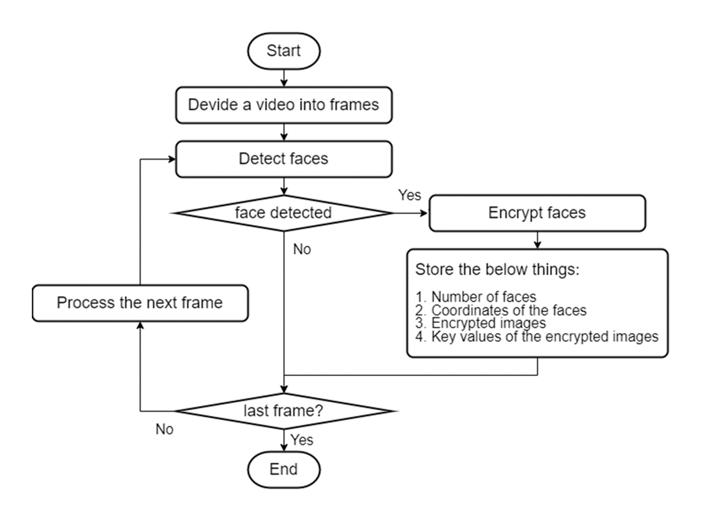
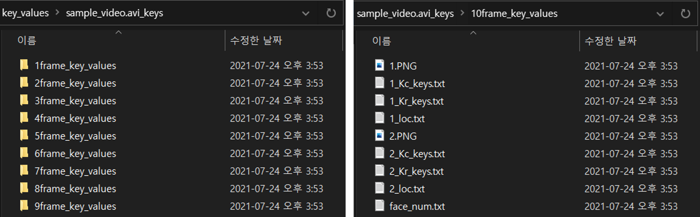
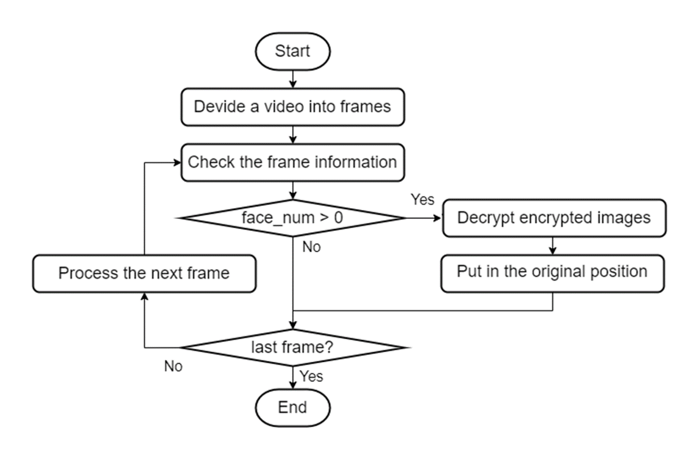

# Face-Encryption-Decryption-In-Video
Detects and encrypts/decrypts the faces of people in the video using the image encryption and decryption using Rubix's Cube Principle.


## Installation
- [dannyi96/Image-Cryptography](https://github.com/dannyi96/Image-Cryptography)
- [ageitgey/face_recognition](https://github.com/ageitgey/face_recognition)
---
## Encryption 

<br/><br/>



For every frame, the key values and encrypted images of faces are generated and stored in specific folder.

## Decryption


## Running
### Encrypt
  1. Run ``` python encrypt.py <video_name> ```
  2. The encrypted video is stored at ```encrypted/``` folder.       
     The key values and encrypted images of faces generated during encryption are stored in the ```key_values/``` folder.

### Decrypt
  1. Run ``` python decrypt.py <video_name> ```
  2. The decrypted video is stored at ```encrypted/``` folder.     

## Example
  - To encrypt the original video ``` sample_video.avi ```

    1. Run ``` python encrypt.py sample_video.avi ```
  
    2. The encrypted video can be found at ```encrypted/sample_video.avi```.
  
    3. The key values and encrypted images of faces for each frame are stored in ```kye_values/sample_video.avi_keys```

  - To decrypt the encrypted video ``` encrypted/sample_video.avi ```
    1. Run ``` python decrypt.py sample_video.avi ```
  
    2. The decrypted video can be found at ```decrypted/sample_video.avi```.